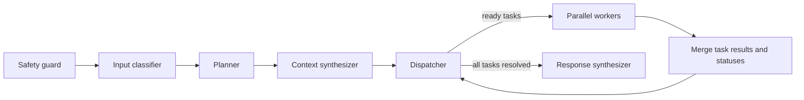

# On-call assistant (OCA)

OCA is a Python service for software engineering requests. It supports bug investigation and reproduction, fixes, features, PR review, release impact analysis, and tech debt work. The LangGraph runtime is separate from the RRSI experiment loop in this repository.



Each request has a task list in LangGraph state. The dispatcher marks ready tasks `running`, fans them out with `Send`, and merges the observations. A task can depend on other task IDs. It starts after all dependencies complete, and is marked `blocked` if a prerequisite fails. Statuses and timestamps are checkpointed in process memory and exposed by the API while a request runs. For persistence across service restarts, replace `InMemorySaver` with a durable LangGraph checkpointer.

## Code structure

| Module | Responsibility |
| --- | --- |
| `agent/` | LangGraph orchestration, state, planning, safety, and release impact |
| `knowledge/` | Versioned team artifact, feature map, and document loading |
| `integrations/` | Model port, GitHub REST, internal gateways, and Codebot contract |
| `api/` | Authenticated request and status service |
| `evaluation/` | Declarative trajectory checks and their CLI |
| `evolution/` | RRSI proposal, evaluation, and selection loop |
| `cli.py` | Local agent command line entry point |

## Configure the team harness

Start with `examples/agent_harness`. Fill `team/team-artifact.json` with domain IDs, definitions, repository metadata, and paths to relevant PRDs and technical decisions. One domain can own many frontend and backend repos. Give each repo a `name`, `kind` (`frontend`, `backend`, `shared`, or `infrastructure`), `responsibility`, routing `signals`, and `depends_on` repo names. Optional `entrypoints`, `verification` test targets, and `reproduction_profile` tell delegated workers where to begin; the gateway owns the actual startup and isolation rules. String entries remain valid for older harnesses. A dependency describes a runtime or contract relationship; it does not automatically schedule a worker. The harness is validated when the graph starts: duplicate domains/features, malformed repositories, unknown repo dependencies, unknown feature repositories, and components outside a feature's repositories fail before a request runs.

```json
{
  "domains": [{
    "id": "warehouse",
    "definition": "Lot picks and material issue",
    "repositories": [
      {"name": "acme/scanner-ui", "kind": "frontend", "responsibility": "lot scan and offline retry", "signals": ["scanner retry", "lot scan"], "depends_on": ["acme/warehouse-api"]},
      {"name": "acme/warehouse-api", "kind": "backend", "responsibility": "pick confirmation API", "depends_on": ["acme/warehouse-execution"]},
      {"name": "acme/warehouse-execution", "kind": "backend", "responsibility": "issue event publisher"}
    ]
  }]
}
```

Fill `feature-map.json` with feature names, domains, repositories, and ground truth paths. A feature may span several domains and repos. Its optional `components` identify each repo's role, `path_globs`, and relevant tests. The older top-level `path_globs` format still works. Changed files produce feature candidates with a path or broader repository match; component roles and tests travel with those candidates. The response treats candidates as hypotheses until code analysis confirms impact.

The planner receives the domain map, feature map, and indexed repository catalog. Selected domains determine allowed repos and documents; `focus_repositories` is computed from the actual repository-scoped tasks. A request can load context from inventory, warehouse, and manufacturing while assigning code work only to the inventory ledger. For a UI feature, it can schedule scanner UI and API workers in parallel, then schedule integration analysis after both finish. The context synthesizer sends selected PRDs, decisions, feature components, and repo topology to Codebot and reproduction workers. Prompt files in `prompts/` can be changed and evaluated by RRSI. Plans are capped at 32 tasks, including cross-repo release comparisons.

`examples/supply_chain/harness` shows four repos per domain: two frontend and two backend repos in inventory, warehouse, and manufacturing. It includes a cross-domain operator workflow and a material-issue incident. The incident's trajectory requires inventory-ledger as the code focus and rejects unrelated UI repos; the release trajectory requires the three named backend comparisons. Add `required_focus_repositories` and `forbidden_focus_repositories` to trajectory cases to verify precise repo selection, alongside `tool_repositories`, parallel waves, and dependencies.

The example harness is intentionally empty. Add your team's repository and feature mappings before asking OCA to investigate or change code.

## Run

```sh
python3 -m venv .venv
.venv/bin/pip install -e '.[serve]'
cp .env.example .env
# Edit .env and replace ANTHROPIC_API_KEY with your key.
export OCA_API_TOKEN=...
export OCA_HARNESS_DIR=/absolute/path/to/team/harness
.venv/bin/uvicorn on_call_assistant.api.service:create_app --factory --host 127.0.0.1 --port 8000
```

The model adapter loads `.env` from the current directory or repository root without overriding existing environment variables. It uses LangChain's `init_chat_model`, so change `OCA_MODEL_PROVIDER` and `OCA_MODEL` together to switch providers or models; install the corresponding LangChain provider package if it is not included here. The example selects Anthropic with `OCA_MODEL_PROVIDER=anthropic`, `ANTHROPIC_API_KEY`, and `OCA_MODEL=claude-sonnet-5`. If your Anthropic key can access multiple workspaces, set `ANTHROPIC_WORKSPACE_ID` so requests include the required workspace header. For OpenAI, set `OCA_MODEL_PROVIDER=openai`, an OpenAI model ID, and `OPENAI_API_KEY`; `OPENAI_BASE_URL` can point to a compatible endpoint. Model calls time out after 120 seconds by default for these two providers; `OCA_MODEL_TIMEOUT_SECONDS` changes that limit. The HTTP service requires `Authorization: Bearer $OCA_API_TOKEN`. `POST /requests` returns a request ID with HTTP 202. `GET /requests/{id}` returns the current lifecycle status, task list, progress counts, trace, and final answer when available. The CLI is `.venv/bin/on-call-assistant --harness /path/to/harness 'Investigate checkout failures'`.

Example:

```sh
curl -H "Authorization: Bearer $OCA_API_TOKEN" -H 'Content-Type: application/json' \
  -d '{"text":"Investigate errors for account acct-123 in checkout","account_id":"acct-123"}' \
  http://127.0.0.1:8000/requests
```

## Tool contracts

| Tool | Configuration | Contract |
| --- | --- | --- |
| GitHub commits, PR files, compare | `GITHUB_TOKEN` and optional `GITHUB_API_URL` | GitHub REST; reads up to 20 recent commits, paginates PR files, or reads one compare response; marks large or patch-limited results `truncated` |
| Jira search/create | `JIRA_GATEWAY_URL` | `POST /execute` with `{"tool": "jira_search" or "jira_create", "arguments": {...}}` |
| Admin lookup | `ADMIN_GATEWAY_URL` | Same `/execute` contract; account ID required |
| Splunk search | `SPLUNK_GATEWAY_URL` | Same `/execute` contract; account ID required |
| Backend/browser reproduction | `REPRODUCER_URL` | Same `/execute` contract with tool `reproduce_backend` or `reproduce_browser`; implement isolated app startup, fixtures, assertions, and browser automation in that service |
| Codebot | `CODEBOT_URL` | `POST /tasks` with task, selected repository, request, team context, and dependency results; without a URL, returns an explicit stub result |

Internal gateways can use `OCA_SERVICE_TOKEN` for a bearer token. Unconfigured tools return `unavailable`; Codebot returns `stub`. OCA does not turn those into claimed findings. Jira creation is disabled unless `OCA_ALLOW_JIRA_CREATE=1` for the service or `--allow-jira-create` for the CLI. The model can suggest a Jira task, but the planner validator rejects execution when creation is disabled. Admin and Splunk tools only receive their planned arguments; Codebot and reproducer receive the selected context and preceding task results.

The reproducer and Codebot are integration contracts here, not bundled implementations. Their gateway services should isolate checkouts, runtime processes, and browser sessions per request. The generic graph does not know how to start every team's application.

## RRSI self-improvement

`examples/langgraph_bridge.py` can invoke this graph directly with `ONCALL_GRAPH_FACTORY=on_call_assistant.agent:create_graph`. Its runner sends each trial's `harness_dir` to the factory, so candidate edits to prompts, team routing, feature map, and policy can be measured. Keep PRDs and technical decisions protected, require evidence for artifact edits, and use an independent verifier for each of the six capabilities. The demo RRSI tasks are synthetic and do not measure this runtime's real-world performance.

### Trajectory evals

`examples/trajectory_cases.json` has paved-path expectations for all six capabilities plus an account investigation. Each expectation can require graph stages, classification, tools, domain and repository routing, tools used on particular repositories, dependency edges, and tools launched in the same dispatch wave. Checks use task IDs and dispatch waves, so worker completion order does not matter. A case scores 1 only when every required check passes; the report also includes the fraction of individual checks passed for diagnosis.

Run the suite with a configured model and mocked tools:

```sh
.venv/bin/on-call-trajectory run-suite examples/trajectory_cases.json \
  --harness examples/demo_harness
```

The command exits nonzero if a case misses an expected path. The tools return dry-run results, so this measures routing decisions rather than code correctness or real integrations. For RRSI, add `expected_trajectory` to each task's hidden verifier fields and set `verifier_command` to `["python3", "-m", "on_call_assistant.evaluation.cli", "verify-rrsi"]`. The bridge returns the trace, task list, selected plan, capability, answer, and policy token count. Keep this trajectory score alongside task-owned correctness tests: taking the intended route is necessary but does not establish that a patch, review, or diagnosis is correct.

The current in-memory checkpointer and gateway contracts are a first deployment boundary. Before handling live customer data, configure team-specific artifact exports, authenticated gateways, isolated reproduction environments, and a durable checkpointer if requests must survive service restarts.
