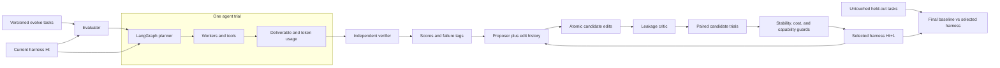

# Harness evolution

The RRSI loop evaluates versioned harness edits around the LangGraph on-call assistant. It proposes candidates, screens them, runs paired trials, applies score and cost guards, and finally measures transfer on held-out tasks. See the [agent runtime](agent.md) and the [local architecture view](../architecture.html).

## Run the synthetic example

From this directory:

```sh
PYTHONPATH=src python3 -m on_call_assistant.evolution.cli examples/demo.json
PYTHONPATH=src python3 -m unittest discover -s tests
```

The demo deliberately has simple deterministic tasks. It validates the plumbing and selection loop; its scores are not evidence of real agent quality. Run artifacts appear under `runs/run-*/`, including `summary.json`, candidate diffs and verdicts, the per-edit history, per-trial outcomes, and the selected harness directory.

## Run the live-model smoke demo

Run RRSI as a separate experiment process. It loads a snapshot of the on-call app's graph and a versioned harness for each trial; the production request path does not start the evolution loop. The app owns request execution and trace collection. RRSI owns task sampling, candidate edits, verification, and selection. Promotion of a selected harness is a separate review and deployment step.

```sh
# From the repository root
python3 -m venv .venv
.venv/bin/python -m pip install -e .
# Replace the ANTHROPIC_API_KEY placeholder in .env first.
.venv/bin/on-call-evolve examples/live.json
```

Copy `.env.example` to `.env` if it is missing. `OCA_MODEL_PROVIDER` chooses Anthropic or OpenAI, and `OCA_MODEL` chooses a model for that provider. The live config uses the real LangGraph classifier, planner, and response synthesizer with model calls. Its worker tools return dry-run results, so it does not contact Jira, Splunk, Git, or Codebot. One model-backed proposal may replace `prompts/planner.txt`; a model-backed critic and independent trajectory verifier screen and score it. The two evolve cases and two held-out paraphrases are a quick integration smoke test, not evidence of software engineering task success. A candidate may be rejected or leave the held-out score unchanged.

The command prints the run directory and the held-out before/after score. Inspect `summary.json`, `candidates.jsonl`, `trials.jsonl`, and the candidate harness under that run directory. Model usage is metered in `policy_tokens` for the agent trials; the demo does not include proposer and critic tokens in that metric. Since the live config invokes `../.venv/bin/python` from `examples/`, keep the virtual environment at the project root or update those command arrays.

## Architecture



The score is the mean of the six capability scores, so a large supply of one type of task does not drown out another. The harness also reports domain scores and rejects a candidate with excessive regression in any domain. Each trial uses the same seed for incumbent and candidates in a round. The unchanged baseline is evaluated repeatedly to estimate the empirical noise band. The held-out suite is evaluated only after evolution finishes.

The paper's regularizers appear directly in the loop:

1. A cosine schedule limits the number of atomic edits per candidate, with fewer edits in later rounds.
2. The proposer receives all measured edits, including rejected hypotheses, and an exploration directive when improvement stalls.
3. A critic screens candidate diffs for task-specific leakage before running the agent.
4. Selection applies the best historical score minus the noise band, the paper's gain-dependent token-cost rule, its within-band cost/structural-novelty rule, and a per-capability regression guard.
5. Components with no positive recent contribution become pruning targets in later proposal requests.

Pruning is a proposal directive, not automatic deletion; the deletion itself must be proposed and measured. The proposer can change any text file in the harness directory, but this implementation does not synthesize edits without a configured proposer command.

## Connect your LangGraph agent

Copy `examples/demo.json` to your experiment configuration and replace the command arrays and task paths. Every command receives one JSON object on stdin and returns one JSON object on stdout. Logs belong on stderr. Command paths and experiment paths are resolved relative to the config file's directory.

The `runner_command` gets:

```json
{"task":{"id":"case-1","capability":"bug_fix","input":{}},"harness_dir":"/abs/path","seed":123,"workspace":"/tmp/path"}
```

It returns `{"answer": ..., "policy_tokens": 1234, "trace": ...}`. The runner never receives hidden verifier fields such as the correct domain or repository set. `examples/langgraph_bridge.py` is a starting point: set `ONCALL_GRAPH_FACTORY=your_module:factory`, make the factory load prompts and tools from `harness_dir`, map the input to your graph state, and return the final answer plus *total* policy tokens across planner and workers. The planner should infer the domain, use the team artifact and feature map to select all relevant repositories, and fetch the applicable PRDs and designs before delegating. Workers can then consult Jira and Splunk and inspect Git state. Graph checkpoints and external side effects should be isolated per trial using the supplied seed and workspace.

The `verifier_command` gets the full task, the runner output, and workspace. It returns `{"reward": 0.0..1.0, "failure_tags": ["..."]}`. Use task-owned tests or assertions whenever possible. Examples of useful verification:

| Capability | Primary verifier evidence |
| --- | --- |
| Bug analysis and reproduction | Reproducer triggers the failure; diagnosis identifies the causal path |
| Bug fix | Previously failing test passes; relevant regression tests pass |
| Feature | Acceptance tests pass; contract and compatibility checks pass |
| PR review | Seeded defects found with correct file and line evidence; false positives penalized |
| Release impact | Changed interfaces mapped to affected callers, tests, and owners; omissions penalized |
| Tech debt | Flag or dead code removed with references and tests clean; behavior preserved |

For routing tasks, keep `domain` and the expected repository set outside public `input`; verify the selected domain and *all* required repositories in the agent output. A feature may span multiple repositories. Task-level `domain` metadata is aggregated into `domain_scores` for regression checks and reports, but is not sent to the runner.

The `proposer_command` gets the current harness directory, aggregate feedback, full per-edit history, annealed `edit_budget`, `max_candidates`, untried and pruning components, and a stall flag. It returns:

```json
{"candidates":[{"edits":[{"component":"memory","hypothesis":"Map checkout retries to both owning repos","path":"feature-map.json","operation":"replace","sources":["prds/checkout.md","git:example/checkout-api"],"content":"new complete file contents"}]}]}
```

The component must be one of `prompt`, `control_flow`, `config`, `output_plumbing`, `context_mgmt`, `client_tool`, `skill`, `memory`, or `subagent`. Operations are `add`, `replace`, and `delete`; replacement sends the complete new file. Each edit is independently attributable and counts against the current budget. A proposer can be your existing planner, a coding agent, or any model-backed process that obeys this JSON protocol. Its request identifies protected ground-truth paths and paths that require cited sources.

The optional `critic_command` gets a diff, edit metadata with source references, ground-truth paths, and evolve-task identifiers/forbidden terms. It returns `{"approved": true}` or `{"approved": false, "reason": "..."}`. A static exact-term screen always runs. Replace the demo critic with a semantic critic that rejects benchmark-specific logic and checks that updates to the team artifact or feature map are supported by the cited PRD, design, Git, Jira, or Splunk evidence. The engine requires source references for configured index paths; it does not itself establish that those references prove the change.

`protected_paths` prevents candidate edits to the PRD and decision snapshots. `evidence_required_paths` requires a nonempty `sources` list on edits to the team artifact and feature map. The demo config shows both. New ground-truth document versions should start a new experiment window so incumbent and candidate see the same source material.

Keep evolve and held-out tasks in separate files with disjoint IDs. Each task has `id`, one of the six `capability` values, public `input`, and any hidden verifier fields. Put secret answer keys and real held-out data outside the proposer's filesystem access in production; the protocol alone cannot enforce process isolation. Run each coding task in a disposable container or worktree, and make external services deterministic or mocked for repeatable scoring.

## What to do first on the real system

Build 5–10 representative, independently verifiable tasks per capability from resolved incidents and merged work. Fix the graph model/version, tools, service fixtures, and token accounting. Implement the runner and verifier, measure the baseline, then connect a proposer. Keep a pristine held-out set from different repositories, time periods, or workflow variants; do not inspect its outcomes during proposal tuning. This is where transfer, the paper's main concern, becomes measurable.
